# UI challenge 01 — the transcript reader on a phone

This is our current design for the transcript page on a phone: the reader,
its states, and every control it has to carry. It is the result of one
redesign pass. **Your job is the next pass.** Find what is still wrong,
what is missing, and what the flow should be — then show us.

## The reader

| 320 px | 375 px | 390 px |
|---|---|---|
| 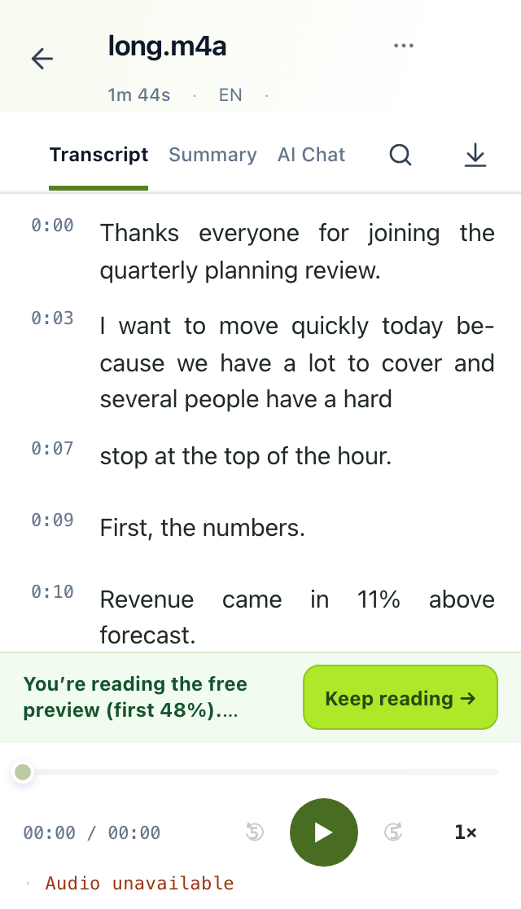 | 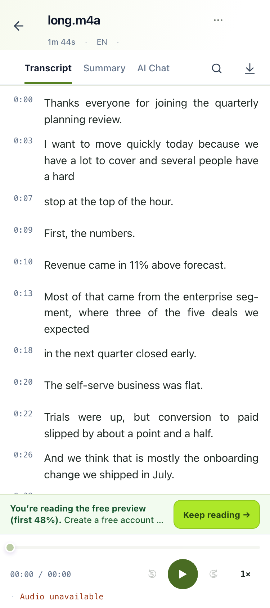 | 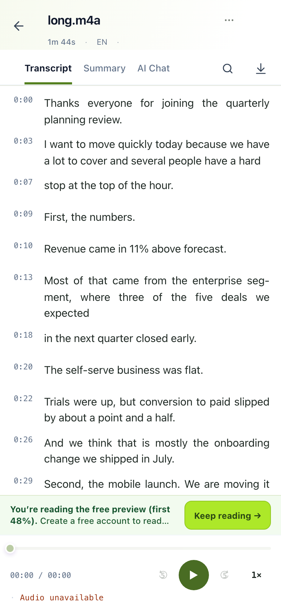 |

Two header rows, three tabs, search and download as icons, timestamps in the
gutter, the "Keep reading" bar for a free preview sitting above the player.

## The states

| Long transcript, scrolled | Preview boundary | Search |
|---|---|---|
|  | 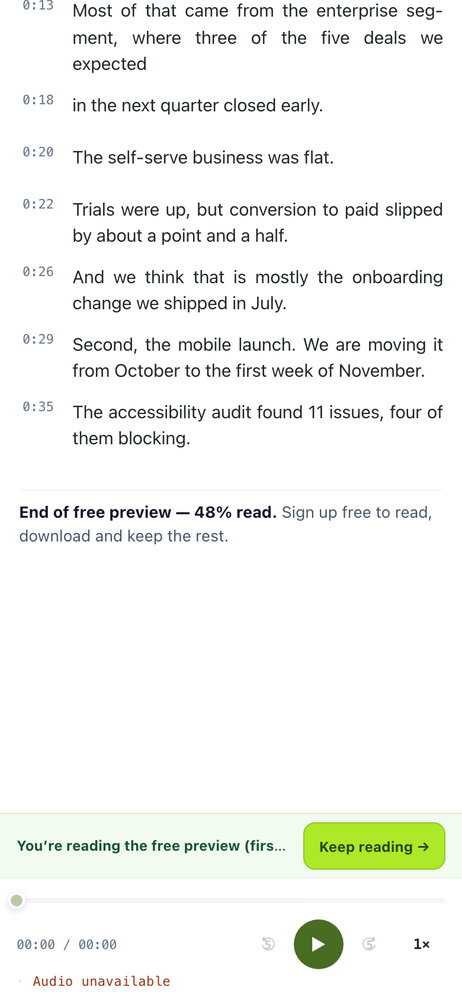 | 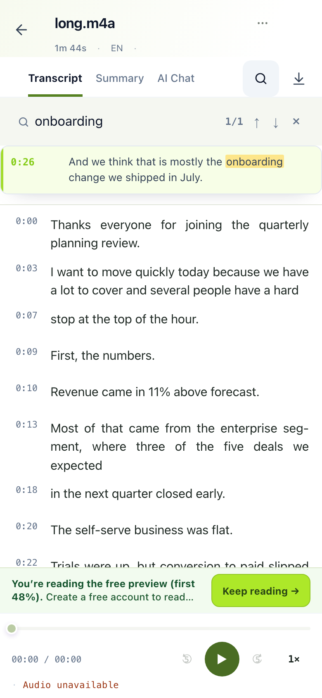 |
| The header scrolls away; the bar and the player stay. | The end note sits above the stack; nothing hides under it. | The field opens under the tabs, with a count and highlights. |

| Download | More menu | Reading settings |
|---|---|---|
| 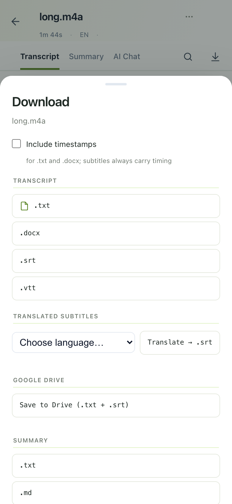 | 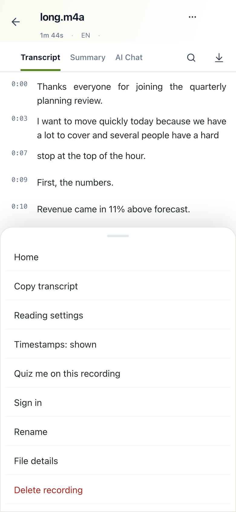 | 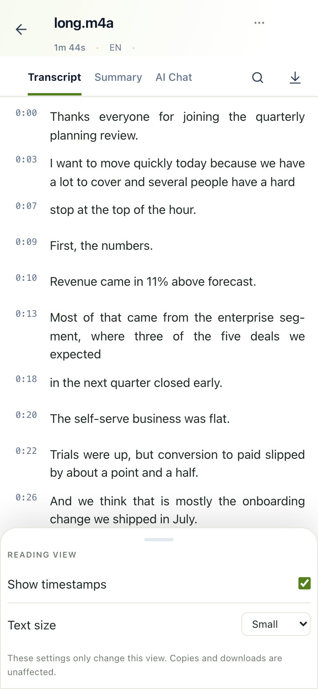 |
| A bottom sheet: formats, translated subtitles, Drive, summary. | Home, copy, settings, timestamps, quiz, sign in, rename, details, delete. | Timestamps, speakers, text size. |

| Text selection | Keep reading → sign-up | Load failure | Not on this account |
|---|---|---|---|
| 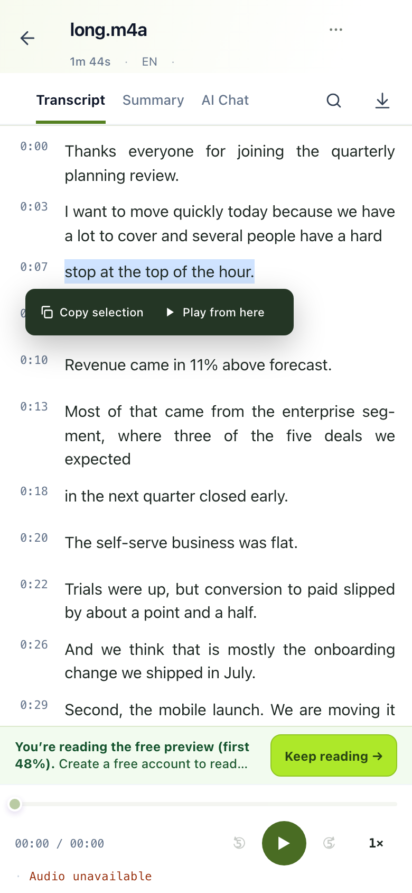 | 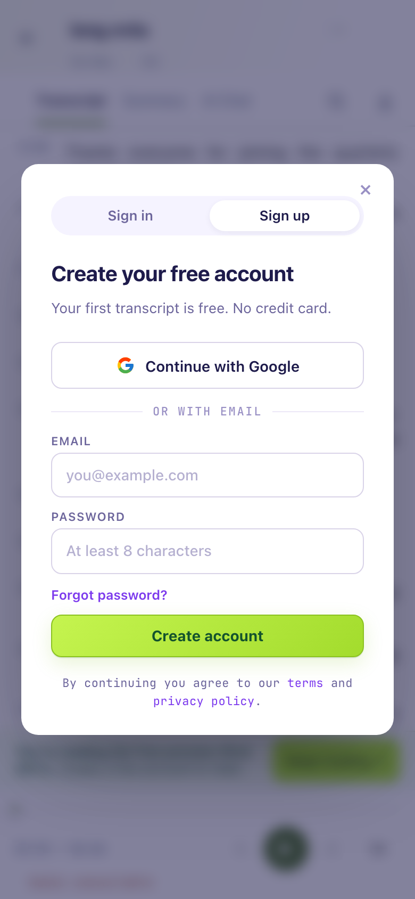 | 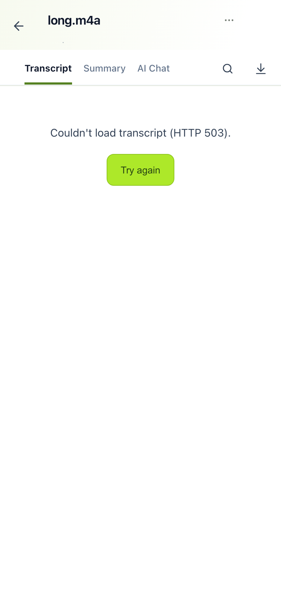 | 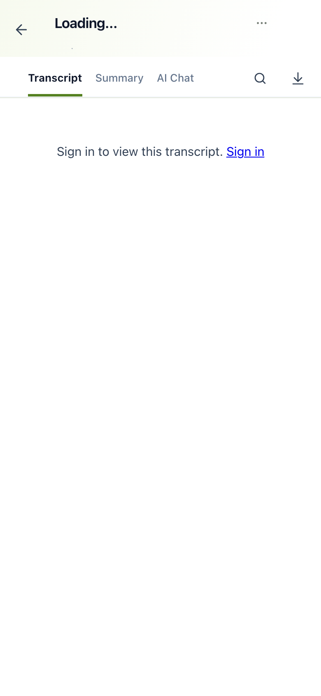 |

And the same page on a laptop, which the phone design must not break:

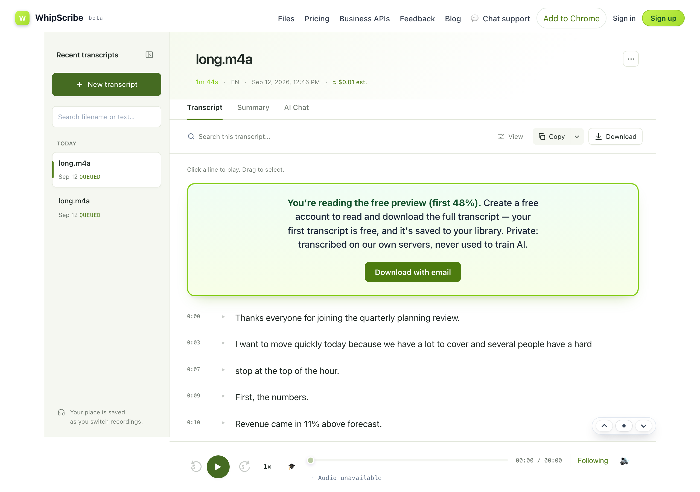

## The task

Produce the **next version**: what this reader should look like and how it
should behave on a phone, better than what is above.

- A mockup (Figma, Sketch, a drawing, an HTML prototype — anything we can
  look at), with **current / yours side by side** for every screen you
  change.
- A short note: what you changed, why, and what you deliberately kept. If
  you think a screen above is already right, say so and why — that counts.
- If you build it as HTML, put it in `challenges/01-mobile-transcript/next/`
  in your fork so it can be opened on a phone.

Submit as a pull request, or as a **Proposal** issue with the images attached.

## Questions worth answering on the way

- What is the one thing a person on a phone came here to do, and how many
  taps away is it now? Can it be fewer?
- The "Keep reading" bar and the player take the bottom of the screen. Is
  that the right trade, and what happens when the keyboard is up?
- The More menu has nine items. Which of them belong there, which belong on
  the screen, and which should not exist on a phone?
- Search, download, settings: three ways to open a panel. Should they feel
  like one?
- What does the reader look like while the transcript is still processing?
  There is no screen for that above. Design it.
- Speakers: the screens above show a single-speaker file. Show a meeting
  with four speakers at 320 px.
- Text selection on a phone: what should happen after you select a line?
- The desktop page is unchanged. Should it be?

## What we score

UI and UX craft carries this one: hierarchy, touch targets, states, copy,
and the flow between screens. A pass that removes more than it adds, and
explains why, scores above one that adds features. See `../../CHECKLIST.md`.
