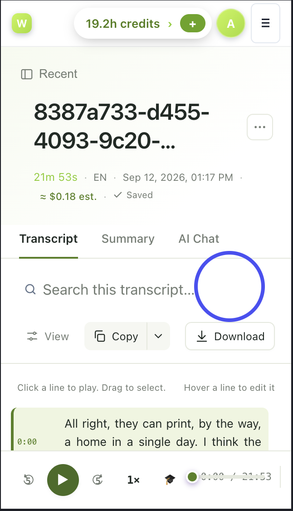

# UI challenge 01 — the transcript page on a phone

This is the transcript page as it looks on a phone today. Redesign it.

## What you are looking at

A finished transcript, 21 minutes long, opened on a phone. From the top:
credits and account, the file's title, its details, three tabs (Transcript,
Summary, AI Chat), a search field, view/copy/download controls, a hint line,
the first transcript line, and a player pinned to the bottom.

The blue circle is ours: an empty region next to the search field on a
screen where every pixel is precious. Start there, but do not stop there.

## The task

Produce an **after**: how this screen should look and behave on a phone.

- A mockup (Figma, Sketch, a drawing, an HTML prototype — anything we can
  look at), plus **before/after side by side**.
- A short note: what you changed, why, and what you deliberately kept.
- If you build it as HTML, put it in `challenges/01-mobile-transcript/after/`
  in your fork so it can be opened on a phone.

Submit as a pull request, or as a **Proposal** issue with the images attached.

## Questions worth answering on the way

- What is the one thing a person on a phone came here to do, and how many
  taps away is it?
- The title is a machine id. What should stand in for it, and where does the
  real name come from?
- Which of the header's three rows earn their place above the transcript?
- The hint says "hover a line to edit". There is no hover on a phone.
- What happens to the player when the keyboard is up, or when the user is
  reading line 400?
- What does this screen look like while the transcript is still processing,
  and when it failed?

## What we score

UI and UX craft carries this one: hierarchy, touch targets, states, copy.
A redesign that removes more than it adds, and explains why, will score
above one that adds features. See `../../CHECKLIST.md`.
